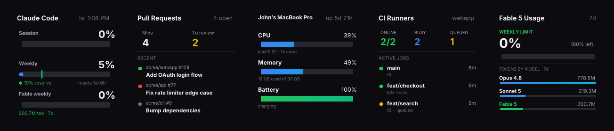
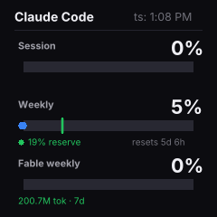
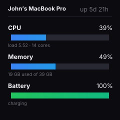
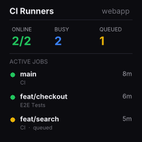
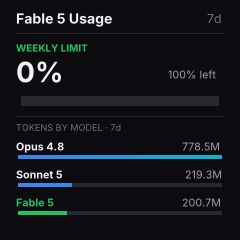

# geekmagic-stats

Push live developer stats — Claude Code usage, GitHub PRs, CI runners, system vitals, and per-model token usage — to a [GeekMagic SmallTV](https://geekmagic.cc) display over your local network.



One command renders every enabled screen and pushes them to the device as an auto-cycling album. The rotator only pushes when the device is reachable, so leaving it running is a no-op when you're away.

## Screens

| | |
|---|---|
|  | **Claude Code** — Session (5h) and Weekly (7d) usage windows with pace markers, plus your **Fable** weekly-limit and token volume (see below). |
|  | **Pull Requests** — open PRs you authored and PRs awaiting your review, each with a live CI status dot (green pass / red fail / gray no-checks). |
|  | **System Vitals** — CPU load, memory pressure, and battery, color-coded by severity, with uptime. |
|  | **CI Runners** — self-hosted GitHub Actions runners running locally in Docker: online/busy/queued counts and the branches currently under test. |
|  | **Model Usage** — Fable weekly-limit gauge plus token volume by model, scanned from your local Claude Code logs. |

*(The Pull Requests and CI Runners shots above use sample data via `--demo`.)*

## Fable 5 usage

The Claude usage API doesn't expose a dedicated Fable rate-limit window in its legacy fields, but it now reports **per-model weekly limits** in a `limits` array. This tool reads that array and surfaces your **Fable weekly-limit percentage** — the same "how close am I to my weekly cap" number for the Fable model — on both the Claude Code screen and the Model Usage screen.

Because the API only gives a *percentage against the limit*, actual **token volume** per model (including Fable) is computed separately by scanning your local Claude Code session logs (`~/.claude/projects/**/*.jsonl`) over the last 7 days. So you get both: the weekly-limit gauge (from the API) and the raw token counts (from your logs).

## How usage is fetched (API, not the CLI)

Earlier versions shelled out to the `claude-code-stats` crate. This version talks to the Anthropic **OAuth usage API directly** (`https://api.anthropic.com/api/oauth/usage`):

- It reads your existing **Claude Code OAuth token from the macOS keychain** (falling back to `~/.claude/.credentials.json`). No API key is stored, entered, or committed anywhere — it reuses the credential Claude Code already manages.
- Responses are **cached** to `~/.cache/geekmagic-stats/usage.json` for 60s. If a fetch fails (e.g. a transient `429`), the last cached response is reused so the screen never blanks.
- If no credential is found or the API errors with no cache, the screen shows a clear "Not connected" card instead of failing.

## Requirements

- **GeekMagic SmallTV Ultra** (240×240, tested on firmware Ultra-V9.0.43) on the same LAN
- **macOS** — uses the keychain, `scutil`, `sysctl`, `pmset`, and `memory_pressure`
- **Rust toolchain**
- Signed into **Claude Code** (the usage screen reads its keychain token)
- Optional: **[`gh`](https://cli.github.com) CLI** for the PR and CI screens; **Docker** for the CI Runners screen

## Install

```sh
cargo install --path .
```

Installs these binaries to `~/.cargo/bin/`:

| Binary | Screen |
|---|---|
| `geekmagic-all` | Renders all enabled screens and pushes them as a rotating album |
| `geekmagic-stats` | Claude Code usage (Session / Weekly / Fable weekly) |
| `geekmagic-git` | Pull Requests |
| `geekmagic-sys` | System vitals |
| `geekmagic-ci` | CI runners |
| `geekmagic-usage` | Per-model token usage |

## Usage

### Rotating album (recommended)

```sh
# Render every enabled screen and push as an auto-cycling album
geekmagic-all --host 192.168.1.50

# Pick a subset, in order
geekmagic-all --host 192.168.1.50 --screens stats,ci

# Refresh the data every 60s (device cycles screens on its own)
geekmagic-all --host 192.168.1.50 --daemon 60

# Save all screens as PNGs instead of pushing
geekmagic-all --output-dir ./preview
```

### Individual screens

```sh
geekmagic-stats --host 192.168.1.50
geekmagic-git   --host 192.168.1.50
geekmagic-sys   --host 192.168.1.50
geekmagic-ci    --host 192.168.1.50
geekmagic-usage --host 192.168.1.50

# Preview any screen to a file (no device needed)
geekmagic-stats --output preview.png

# Preview PR / CI layouts with sample data (no gh/Docker needed)
geekmagic-git --demo --output pr.png
geekmagic-ci  --demo --output ci.png
```

Every binary probes the device first and **skips the push if it's unreachable** — a built-in "am I home?" check — so a running daemon quietly no-ops when you're away.

### Configuration

Config is read from `~/.config/geekmagic-stats/config.toml`:

```toml
host = "192.168.1.50"

# Screens to rotate through, in order.
# Available: stats, git, sys, ci, usage
screens = ["stats", "git", "sys", "ci"]

# Seconds each screen shows on the device before advancing
interval = 10

# Optional: refresh interval for daemon mode (seconds)
daemon = 60
```

Precedence: CLI flags → config file → built-in defaults. Override the path with `--config /path/to/config.toml`. `host` is required for uploads unless you use `--output`/`--output-dir`.

### Run on startup (macOS)

Create `~/Library/LaunchAgents/com.geekmagic.stats.plist`:

```xml
<?xml version="1.0" encoding="UTF-8"?>
<!DOCTYPE plist PUBLIC "-//Apple//DTD PLIST 1.0//EN" "http://www.apple.com/DTDs/PropertyList-1.0.dtd">
<plist version="1.0">
<dict>
    <key>Label</key>
    <string>com.geekmagic.stats</string>
    <key>ProgramArguments</key>
    <array>
        <string>/Users/YOU/.cargo/bin/geekmagic-all</string>
        <string>--daemon</string>
        <string>60</string>
    </array>
    <key>RunAtLoad</key>
    <true/>
    <key>KeepAlive</key>
    <true/>
    <!-- launchd gives a minimal PATH; the CI/vitals screens need gh, docker, etc. -->
    <key>EnvironmentVariables</key>
    <dict>
        <key>PATH</key>
        <string>/opt/homebrew/bin:/usr/local/bin:/usr/bin:/bin:/usr/sbin:/sbin</string>
    </dict>
    <!-- The daemon writes its own log (~/Library/Logs/geekmagic.log) in append
         mode and auto-rotates it at 2 MB, so keep launchd out of that file. -->
    <key>StandardOutPath</key>
    <string>/dev/null</string>
    <key>StandardErrorPath</key>
    <string>/Users/YOU/Library/Logs/geekmagic.err.log</string>
</dict>
</plist>
```

In daemon mode the log is written directly by `geekmagic-all` (append-only, no held file handle) and rotates automatically once it passes 2 MB — the previous generation is kept as `geekmagic.log.1`.

```sh
# Start
launchctl bootstrap gui/$(id -u) ~/Library/LaunchAgents/com.geekmagic.stats.plist

# Watch logs
tail -f ~/Library/Logs/geekmagic.log

# Restart after rebuilding
cargo install --path . && launchctl kickstart -k gui/$(id -u)/com.geekmagic.stats

# Stop (KeepAlive means a plain kill just respawns it)
launchctl bootout gui/$(id -u)/com.geekmagic.stats
```

The agent runs while you're logged in and, thanks to the reachability check, only pushes when the device is on your network.

## How it works

1. Each screen gathers its data (usage API, `gh`, Docker, `sysctl`/`pmset`, or a log scan).
2. Screens render to 240×240 dark-themed images via `image` + `imageproc` + `ab_glyph` with the Inter font, from a shared `draw` module.
3. Images are JPEG-encoded and uploaded via multipart POST to the device's HTTP API.
4. The rotator clears the device's image folder and re-uploads the set, then enables Photo Album autoplay so the device cycles through them.

The device runs a plain HTTP server with no authentication. Images are uploaded to `/doUpload?dir=/image/` and shown by setting theme 3 (Photo Album).

## Project structure

```
src/
  lib.rs         Shared library (geekmagic_common)
  draw.rs        Shared canvas/colors/fonts/bars/text primitives
  config.rs      Loads ~/.config/geekmagic-stats/config.toml
  upload.rs      JPEG encode, device upload, album mode, reachability probe
  rotate.rs      geekmagic-all: render enabled screens, push as album
  stats.rs       OAuth usage API client + on-disk cache
  render.rs      Claude Code screen (Session / Weekly / Fable weekly)
  pr.rs          Pull Requests screen (via gh)
  sysinfo.rs     System vitals screen
  ci.rs          CI runners screen (Docker + GitHub API)
  usage.rs       Per-model token usage (local log scan)
  main.rs, git.rs, sys.rs, ci_bin.rs, usage_bin.rs   Thin binaries
fonts/
  Inter-Regular.ttf, Inter-Bold.ttf
```

## Device compatibility

Built for the GeekMagic SmallTV Ultra (240×240 LCD). The firmware has some HTTP quirks (duplicate `Content-Length` headers, data after `Connection: close`) which are handled gracefully. Other GeekMagic models that support the same HTTP API and Photo Album theme should work — the SmallTV Pro uses theme 4 instead of 3 and has a 128×128 display.

## Credits

Forked from [jimmystridh/geekmagic-stats](https://github.com/jimmystridh/geekmagic-stats).
